# FaceZen — Aulas para o NotebookLM

*Todo o conteúdo do FaceZen organizado em aulas curtas: uma para cada um dos 15 exercícios essenciais, com desenho, e uma para cada tema de skincare.*

## Como usar este arquivo

1. No NotebookLM, crie um notebook e envie este PDF como fonte.
2. Para cada aula, abra **Visão geral em vídeo**, clique em **Personalizar** e cole o bloco “Para o NotebookLM” da aula.
3. Gere um vídeo por aula. As aulas estão na mesma ordem do curso no app.

**Regras de tom para todos os vídeos**

- Português do Brasil, tom acolhedor e direto, frases curtas.
- Linguagem neutra em gênero (“que bom que você chegou”, nunca “obrigada” ou “pronta”).
- Sem promessas: não prometa lifting, fim de rugas, de olheiras ou de papada, nem rejuvenescimento. Fale em conforto, relaxamento, consciência e ritual.
- Segurança primeiro: diga sempre quando pular o exercício e os sinais para parar.
- Sem meditação nem respiração guiada.

# Módulo 1 · Comece aqui

Como funciona, as regras de ouro e o seu programa.

## Aula 1 · Como o FaceZen funciona

*Quatro linhas de trabalho e três princípios que guiam tudo.*

**Passo a passo**

1. O FaceZen junta quatro coisas: exercícios com leve resistência dos dedos, posturas que você segura por alguns segundos, massagem e o skincare básico.
2. Funciona como um treino: aquecer, trabalhar o rosto inteiro, descansar, progredir aos poucos e manter.
3. Princípio 1 · Pouco, bem feito e com frequência. Sessões curtas valem mais que uma longa de vez em quando.
4. Princípio 2 · Rosto inteiro, com foco. Toda sessão passa pelo rosto todo; o seu objetivo ganha alguns minutos a mais.
5. Princípio 3 · Conforto é o limite. Nada deve doer, arder, repuxar ou marcar a pele.

**Mais detalhes**

- Trabalhar só uma área pode criar tensão em outras. Por isso existe a série de rosto inteiro.
- Os músculos do rosto são finos e cansam rápido: mais força não significa mais resultado.

> **Para o NotebookLM (Visão geral em vídeo → Personalizar):**
> Crie um vídeo curto, de 2 a 4 minutos, só sobre a aula “Como o FaceZen funciona” do FaceZen. Explique um ponto por vez, na ordem do passo a passo, com um exemplo prático do dia a dia.
> Siga o tom do FaceZen: frases curtas, linguagem neutra em gênero, nenhuma promessa de resultado, e termine lembrando quando parar.

## Aula 2 · O que muda no rosto e onde a prática entra

*O que os exercícios podem ajudar, e o que eles não fazem.*

**Passo a passo**

1. Com o tempo, três coisas mudam em todo mundo: os ossos do rosto, as almofadinhas de gordura e o colágeno da pele.
2. Somam-se fatores do dia a dia: sol sem protetor, cigarro, noites mal dormidas, estresse e falta de hidratação.
3. O rosto tem dezenas de músculos. Diferente de osso e gordura, músculo responde a estímulo.
4. A prática ajuda na consciência (perceber quando franze a testa ou aperta os dentes), no relaxamento, no tônus e na postura.
5. Ela não repõe osso nem gordura, não substitui o protetor solar, não trata doença de pele e não tem prazo garantido.

| Região | Músculo e o que ele faz |
|---|---|
| Testa | Frontal: levanta as sobrancelhas |
| Entre as sobrancelhas | Corrugador e prócero: franzem |
| Olhos | Orbicular dos olhos: fecha e aperta os olhos |
| Maçãs do rosto | Zigomáticos: levantam o sorriso |
| Bochecha | Bucinador: suga e empurra o ar |
| Boca | Orbicular da boca: fecha e projeta os lábios |
| Mandíbula | Masseter: mastiga (e aperta na tensão) |
| Pescoço | Platisma: tensiona a pele do pescoço |

> **Para o NotebookLM (Visão geral em vídeo → Personalizar):**
> Crie um vídeo curto, de 2 a 4 minutos, só sobre a aula “O que muda no rosto e onde a prática entra” do FaceZen. Explique um ponto por vez, na ordem do passo a passo, com um exemplo prático do dia a dia.
> Siga o tom do FaceZen: frases curtas, linguagem neutra em gênero, nenhuma promessa de resultado, e termine lembrando quando parar.

## Aula 3 · As 10 regras de ouro

*O que vale para todos os exercícios, sempre.*

**Passo a passo**

1. Aqueça antes: um a dois minutos de pescoço e rosto.
2. Nunca com a pele seca: use um sérum, óleo ou creme que você já usa. A pele desliza, nunca é arrastada.
3. Trabalhe o rosto inteiro em toda sessão e some o módulo do seu objetivo.
4. Pouco e com frequência. No máximo 15 minutos por dia.
5. Descanse: solte o rosto entre as séries e tenha pelo menos um dia de folga por semana.
6. Não franza a testa nos exercícios de olhos e boca. Vigie no espelho; se franzir, apoie os dedos na testa.
7. Respire pelo nariz, sem prender o ar.
8. Troque de série a cada período e aumente as repetições aos poucos.
9. Pare ao primeiro sinal: dor, ardor, estalo na mandíbula, tontura, visão embaçada, vermelhidão que não passa ou marca roxa.
10. Termine relaxando e aplique o hidratante (e o protetor, se for de manhã).

> **Para o NotebookLM (Visão geral em vídeo → Personalizar):**
> Crie um vídeo curto, de 2 a 4 minutos, só sobre a aula “As 10 regras de ouro” do FaceZen. Explique um ponto por vez, na ordem do passo a passo, com um exemplo prático do dia a dia.
> Siga o tom do FaceZen: frases curtas, linguagem neutra em gênero, nenhuma promessa de resultado, e termine lembrando quando parar.

## Aula 4 · Prepare-se em 2 minutos

*Materiais e o checklist antes de cada sessão.*

**Passo a passo**

1. Rosto limpo, sem maquiagem nem protetor.
2. Mãos lavadas, unhas curtas, sem anéis. Cabelo preso.
3. Espalhe no rosto e no pescoço 3 a 4 gotas de sérum ou óleo, ou uma ervilha de creme.
4. Sente com a coluna longa, ombros baixos e queixo paralelo ao chão.
5. Espelho na altura dos olhos.
6. Olhe a pele: se houver ferida ou espinha inflamada, pule os movimentos naquela área hoje.

**Mais detalhes**

- Lave as ferramentas antes e depois. Não use ferramenta lascada e não compartilhe.
- Manhã desincha e prepara o dia. Noite relaxa e solta a tensão. Em pausas curtas, só os exercícios sem as mãos.

> **Para o NotebookLM (Visão geral em vídeo → Personalizar):**
> Crie um vídeo curto, de 2 a 4 minutos, só sobre a aula “Prepare-se em 2 minutos” do FaceZen. Explique um ponto por vez, na ordem do passo a passo, com um exemplo prático do dia a dia.
> Siga o tom do FaceZen: frases curtas, linguagem neutra em gênero, nenhuma promessa de resultado, e termine lembrando quando parar.

## Aula 5 · Seu programa de 8 semanas

*Como a sua sessão é montada e como ela evolui.*

**Passo a passo**

1. Toda sessão tem blocos: aquecer → rosto inteiro → seu foco → relaxar.
2. Existem duas séries de rosto inteiro, A e B. Você alterna para o músculo não se acostumar.
3. Semanas 1 e 2 · Adaptação: Série A, nível iniciante, sem foco. O objetivo é aprender sem franzir a testa.
4. Semanas 3 a 5 · Construção: séries B e A, nível intermediário, e entra o módulo do seu objetivo.
5. Semanas 6 a 8 · Intensificação: nível avançado, só se estiver confortável. Houve incômodo? O app volta ao intermediário.
6. Depois: manutenção, alternando as séries, 4 a 5 dias por semana.

**Mais detalhes**

- Só avance se a fase anterior terminou sem dor, sem cansaço que dura e sem franzir.
- Tem um objetivo secundário? O app alterna: um dia o principal, no outro o secundário.
- Um dia de descanso por semana, sempre.

> **Para o NotebookLM (Visão geral em vídeo → Personalizar):**
> Crie um vídeo curto, de 2 a 4 minutos, só sobre a aula “Seu programa de 8 semanas” do FaceZen. Explique um ponto por vez, na ordem do passo a passo, com um exemplo prático do dia a dia.
> Siga o tom do FaceZen: frases curtas, linguagem neutra em gênero, nenhuma promessa de resultado, e termine lembrando quando parar.

## Aula 6 · Séries e módulos de foco

*O que entra em cada sessão.*

- **Série A:** A3 Meia-lua do pescoço → A5 Balão → T1 Testa lisa → O4 Toque de pena → B1 Do “O” ao sorriso → L1 “O” e “A” → M1 Lábio para cima → R3 Mandíbula solta
- **Série B:** A6 Língua em ponte → T6 Alisar a testa → O5 Olhar em cruz → B3 Peixinho → N1 Sorriso escondido → M4 Soltar o masseter → P2 Pescoço para baixo → R3 Mandíbula solta

**Módulos de foco** (entram a partir da semana 3, antes do relaxamento)

- **A · Bigode chinês:** N1 Sorriso escondido → B1 Do “O” ao sorriso
- **B · Papada e pescoço:** A6 Língua em ponte → M1 Lábio para cima → P2 Pescoço para baixo
- **C · Testa:** T1 Testa lisa → T6 Alisar a testa
- **D · Olhos:** O4 Toque de pena → O5 Olhar em cruz
- **E · Lábios:** L1 “O” e “A” → N1 Sorriso escondido
- **F · Bochechas e contorno:** B1 Do “O” ao sorriso → B3 Peixinho → M4 Soltar o masseter
- **G · Tensão:** M4 Soltar o masseter → T6 Alisar a testa → R3 Mandíbula solta

Com 5 minutos por dia, as doses ficam no nível iniciante para caber o rosto inteiro. Com 10 ou 15 minutos, seguem a fase do programa.

> **Para o NotebookLM (Visão geral em vídeo → Personalizar):**
> Crie um vídeo curto, de 2 a 4 minutos, só sobre a aula “Séries e módulos de foco” do FaceZen. Explique que a série trabalha o rosto inteiro, que A e B se alternam e que o módulo de foco é escolhido pelo objetivo da pessoa.
> Siga o tom do FaceZen: frases curtas, linguagem neutra em gênero, nenhuma promessa de resultado, e termine lembrando quando parar.

## Aula 7 · Quando parar e quando procurar ajuda

*Os sinais que encerram a sessão e quem procurar.*

**Passo a passo**

1. Pare na hora com dor, ardor, estalo na mandíbula, tontura, visão embaçada, vermelhidão que não passa ou marca roxa.
2. Depois de botox, preenchimento, peeling, laser ou cirurgia: espere a liberação de quem fez.
3. Mandíbula que dói, estala ou trava: dentista ou fisioterapeuta.
4. Dor no pescoço, formigamento ou tontura: médico ou fisioterapeuta.
5. Olho vermelho, dolorido ou visão alterada: oftalmologista.
6. Acne profunda, mancha que muda, rosácea ou pinta nova: dermatologista.

> **Para o NotebookLM (Visão geral em vídeo → Personalizar):**
> Crie um vídeo curto, de 2 a 4 minutos, só sobre a aula “Quando parar e quando procurar ajuda” do FaceZen. Explique um ponto por vez, na ordem do passo a passo, com um exemplo prático do dia a dia.
> Siga o tom do FaceZen: frases curtas, linguagem neutra em gênero, nenhuma promessa de resultado, e termine lembrando quando parar.

# Módulo 2 · Aquecer

Três exercícios para preparar pescoço e rosto.

*Um a dois minutos que preparam pescoço e rosto, como o alongamento de um atleta antes do jogo.*

## Aula 8 · A3 Meia-lua do pescoço

*Soltar o pescoço antes de começar.*

- **Região:** Aquecimento
- **Dose:** Iniciante 5 de cada lado · Intermediário 5 de cada lado · Avançado 5 de cada lado
- **Lados:** faça de um lado e depois do outro.

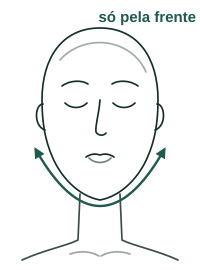

**Passo a passo**

1. Desça o queixo em direção ao peito, devagar.
2. Role a cabeça até a orelha chegar perto do ombro direito.
3. Volte pelo meio e vá para o lado esquerdo.

**Confira no espelho:** Só a metade da frente: a cabeça nunca vai para trás.

**Pule se:** Dor no pescoço ou tontura.

**Fica fora do plano de quem tem:** dor ou histórico no pescoço (cervical).

> **Para o NotebookLM (Visão geral em vídeo → Personalizar):**
> Crie um vídeo curto, de 2 a 4 minutos, só sobre a aula “A3 Meia-lua do pescoço” do FaceZen. Mostre o exercício como um tutorial: para que serve, os 3 passos com calma, a dose de cada nível e como conferir no espelho.
> Use o desenho da aula como imagem principal: explique onde ficam os dedos (em rosa) e o movimento das setas verdes.
> Use comparações do dia a dia, como no texto. A pessoa vai imitar o que ouvir.
> Siga o tom do FaceZen: frases curtas, linguagem neutra em gênero, nenhuma promessa de resultado, e termine lembrando quando parar.

## Aula 9 · A5 Balão

*Aquecer bochechas e boca.*

- **Região:** Aquecimento
- **Dose:** Iniciante 5 voltas · Intermediário 5 voltas · Avançado 5 voltas
- **Onde:** dá para fazer em qualquer lugar, sem as mãos no rosto.

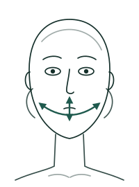

**Passo a passo**

1. Encha as bochechas de ar, com a boca fechada.
2. Passe o ar de uma bochecha para a outra, contando 3 em cada.
3. Leve o ar para cima e para baixo dos lábios, e solte.

**Confira no espelho:** Sem estufar ao máximo e sem prender a respiração.

**Pule se:** Dor na mandíbula ou no ouvido.

**Fica fora do plano de quem tem:** dor, estalo ou disfunção na mandíbula (ATM).

> **Para o NotebookLM (Visão geral em vídeo → Personalizar):**
> Crie um vídeo curto, de 2 a 4 minutos, só sobre a aula “A5 Balão” do FaceZen. Mostre o exercício como um tutorial: para que serve, os 3 passos com calma, a dose de cada nível e como conferir no espelho.
> Use o desenho da aula como imagem principal: explique onde ficam os dedos (em rosa) e o movimento das setas verdes.
> Use comparações do dia a dia, como no texto. A pessoa vai imitar o que ouvir.
> Siga o tom do FaceZen: frases curtas, linguagem neutra em gênero, nenhuma promessa de resultado, e termine lembrando quando parar.

## Aula 10 · A6 Língua em ponte

*Acordar a região embaixo do queixo.*

- **Região:** Aquecimento
- **Dose:** Iniciante 5 repetições · Intermediário 5 repetições · Avançado 5 repetições

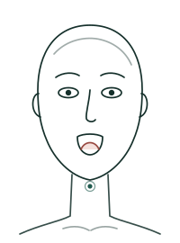

**Passo a passo**

1. Abra um pouco a boca e encoste a ponta da língua atrás dos dentes de baixo.
2. Empurre o meio da língua para fora, como uma ponte.
3. Segure 3 segundos e relaxe.

**Confira no espelho:** Você sente o trabalho embaixo do queixo.

> **Para o NotebookLM (Visão geral em vídeo → Personalizar):**
> Crie um vídeo curto, de 2 a 4 minutos, só sobre a aula “A6 Língua em ponte” do FaceZen. Mostre o exercício como um tutorial: para que serve, os 3 passos com calma, a dose de cada nível e como conferir no espelho.
> Use o desenho da aula como imagem principal: explique onde ficam os dedos (em rosa) e o movimento das setas verdes.
> Use comparações do dia a dia, como no texto. A pessoa vai imitar o que ouvir.
> Siga o tom do FaceZen: frases curtas, linguagem neutra em gênero, nenhuma promessa de resultado, e termine lembrando quando parar.

# Módulo 3 · Testa e olhos

Testa sem franzir e olhos com toque leve.

### Testa e entre as sobrancelhas

*Fortalecer a testa e ensinar o rosto a não franzir sem necessidade.*

## Aula 11 · T1 Testa lisa

*Treinar a testa a não enrugar.*

- **Região:** Testa e entre as sobrancelhas
- **Dose:** Iniciante 1 × 10 · Intermediário 2 × 15 · Avançado 3 × 15

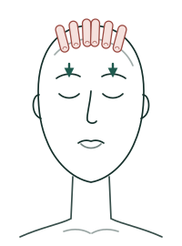

**Passo a passo**

1. Apoie as mãos na testa, como quem afasta a franja, e segure a pele firme.
2. Feche os olhos e tente descer as sobrancelhas, como quando bate o sono.
3. As mãos não deixam descer: sinta a força e solte.

**Confira no espelho:** A testa não enruga e nada de franzir entre as sobrancelhas.

> **Para o NotebookLM (Visão geral em vídeo → Personalizar):**
> Crie um vídeo curto, de 2 a 4 minutos, só sobre a aula “T1 Testa lisa” do FaceZen. Mostre o exercício como um tutorial: para que serve, os 3 passos com calma, a dose de cada nível e como conferir no espelho.
> Use o desenho da aula como imagem principal: explique onde ficam os dedos (em rosa) e o movimento das setas verdes.
> Use comparações do dia a dia, como no texto. A pessoa vai imitar o que ouvir.
> Siga o tom do FaceZen: frases curtas, linguagem neutra em gênero, nenhuma promessa de resultado, e termine lembrando quando parar.

## Aula 12 · T6 Alisar a testa

*Relaxar a testa.*

- **Região:** Testa e entre as sobrancelhas
- **Dose:** Iniciante 30 segundos · Intermediário 30 segundos · Avançado 30 segundos

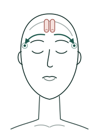

**Passo a passo**

1. Coloque as pontas dos dedos no meio da testa.
2. Deslize devagar até as têmporas, como quem alisa um lençol.
3. Aperte de leve as têmporas por 2 segundos e recomece do meio.

**Confira no espelho:** Pele com um pouco de creme, para deslizar sem repuxar.

> **Para o NotebookLM (Visão geral em vídeo → Personalizar):**
> Crie um vídeo curto, de 2 a 4 minutos, só sobre a aula “T6 Alisar a testa” do FaceZen. Mostre o exercício como um tutorial: para que serve, os 3 passos com calma, a dose de cada nível e como conferir no espelho.
> Use o desenho da aula como imagem principal: explique onde ficam os dedos (em rosa) e o movimento das setas verdes.
> Use comparações do dia a dia, como no texto. A pessoa vai imitar o que ouvir.
> Siga o tom do FaceZen: frases curtas, linguagem neutra em gênero, nenhuma promessa de resultado, e termine lembrando quando parar.

### Olhos e pálpebras

*A região mais delicada: dedos anelares, toque leve e nunca no globo ocular.*

## Aula 13 · O4 Toque de pena

*Relaxar em volta dos olhos. Ótimo de manhã.*

- **Região:** Olhos e pálpebras
- **Dose:** Iniciante 30 segundos · Intermediário 30 segundos · Avançado 30 segundos

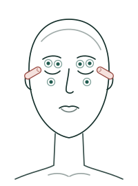

**Passo a passo**

1. Use o dedo anelar, que é o mais leve.
2. Dê batidinhas em volta do olho, sobre o osso: embaixo da sobrancelha e em cima da maçã do rosto.
3. Como gotas de chuva, sem nunca tocar no olho.

**Confira no espelho:** O toque é tão leve que a pele nem se mexe.

> **Para o NotebookLM (Visão geral em vídeo → Personalizar):**
> Crie um vídeo curto, de 2 a 4 minutos, só sobre a aula “O4 Toque de pena” do FaceZen. Mostre o exercício como um tutorial: para que serve, os 3 passos com calma, a dose de cada nível e como conferir no espelho.
> Use o desenho da aula como imagem principal: explique onde ficam os dedos (em rosa) e o movimento das setas verdes.
> Use comparações do dia a dia, como no texto. A pessoa vai imitar o que ouvir.
> Siga o tom do FaceZen: frases curtas, linguagem neutra em gênero, nenhuma promessa de resultado, e termine lembrando quando parar.

## Aula 14 · O5 Olhar em cruz

*Descansar os olhos.*

- **Região:** Olhos e pálpebras
- **Dose:** Iniciante 2 voltas · Intermediário 2 voltas · Avançado 2 voltas
- **Onde:** dá para fazer em qualquer lugar, sem as mãos no rosto.

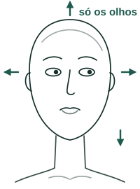

**Passo a passo**

1. Com a cabeça parada, olhe para a direita e depois para a esquerda.
2. Olhe para cima e depois para baixo.
3. Feche os olhos por 5 segundos.

**Confira no espelho:** Só os olhos se mexem; a cabeça fica parada.

**Pule se:** Tontura ou visão dupla.

> **Para o NotebookLM (Visão geral em vídeo → Personalizar):**
> Crie um vídeo curto, de 2 a 4 minutos, só sobre a aula “O5 Olhar em cruz” do FaceZen. Mostre o exercício como um tutorial: para que serve, os 3 passos com calma, a dose de cada nível e como conferir no espelho.
> Use o desenho da aula como imagem principal: explique onde ficam os dedos (em rosa) e o movimento das setas verdes.
> Use comparações do dia a dia, como no texto. A pessoa vai imitar o que ouvir.
> Siga o tom do FaceZen: frases curtas, linguagem neutra em gênero, nenhuma promessa de resultado, e termine lembrando quando parar.

# Módulo 4 · Bochechas e boca

Maçãs do rosto, bigode chinês e contorno da boca.

### Bochechas e maçãs do rosto

*Os músculos que levantam o sorriso e dão contorno ao terço médio do rosto.*

## Aula 15 · B1 Do “O” ao sorriso

*Trabalhar as maçãs do rosto.*

- **Região:** Bochechas e maçãs do rosto
- **Dose:** Iniciante 1 × 10 · Intermediário 2 × 15 · Avançado 3 × 15

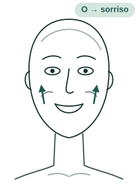

**Passo a passo**

1. Faça um “O” com a boca, como quem diz “Oh!”.
2. Abra um sorriso bem grande, subindo as bochechas.
3. Volte devagar para o “O” e repita.

**Confira no espelho:** Sorria sem apertar os olhos.

> **Para o NotebookLM (Visão geral em vídeo → Personalizar):**
> Crie um vídeo curto, de 2 a 4 minutos, só sobre a aula “B1 Do “O” ao sorriso” do FaceZen. Mostre o exercício como um tutorial: para que serve, os 3 passos com calma, a dose de cada nível e como conferir no espelho.
> Use o desenho da aula como imagem principal: explique onde ficam os dedos (em rosa) e o movimento das setas verdes.
> Use comparações do dia a dia, como no texto. A pessoa vai imitar o que ouvir.
> Siga o tom do FaceZen: frases curtas, linguagem neutra em gênero, nenhuma promessa de resultado, e termine lembrando quando parar.

## Aula 16 · B3 Peixinho

*Bochechas e cantos da boca.*

- **Região:** Bochechas e maçãs do rosto
- **Dose:** Iniciante 1 × 10 · Intermediário 2 × 15 · Avançado 3 × 15
- **Onde:** dá para fazer em qualquer lugar, sem as mãos no rosto.

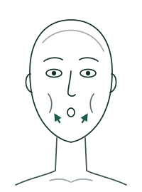

**Passo a passo**

1. Chupe as bochechas para dentro, fazendo boca de peixe.
2. Nessa posição, tente sorrir.
3. Segure 3 segundos e solte.

**Confira no espelho:** Você sente as bochechas trabalhando, sem dor.

**Fica fora do plano de quem tem:** dor, estalo ou disfunção na mandíbula (ATM).

> **Para o NotebookLM (Visão geral em vídeo → Personalizar):**
> Crie um vídeo curto, de 2 a 4 minutos, só sobre a aula “B3 Peixinho” do FaceZen. Mostre o exercício como um tutorial: para que serve, os 3 passos com calma, a dose de cada nível e como conferir no espelho.
> Use o desenho da aula como imagem principal: explique onde ficam os dedos (em rosa) e o movimento das setas verdes.
> Use comparações do dia a dia, como no texto. A pessoa vai imitar o que ouvir.
> Siga o tom do FaceZen: frases curtas, linguagem neutra em gênero, nenhuma promessa de resultado, e termine lembrando quando parar.

### Bigode chinês

*Elevar bochechas e cantos da boca para suavizar a linha entre o nariz e a boca.*

## Aula 17 · N1 Sorriso escondido

*Bochechas e a linha entre o nariz e a boca.*

- **Região:** Bigode chinês
- **Dose:** Iniciante 1 × 20 s · Intermediário 2 × 30 s · Avançado 3 × 30 s

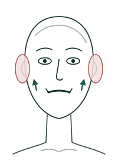

**Passo a passo**

1. Cubra as orelhas com as mãos e puxe a pele de leve para trás.
2. Esconda os lábios para dentro, cobrindo os dentes.
3. Sorria o máximo que conseguir e segure.

**Confira no espelho:** Trabalho nas bochechas e ao lado da boca, testa parada.

> **Para o NotebookLM (Visão geral em vídeo → Personalizar):**
> Crie um vídeo curto, de 2 a 4 minutos, só sobre a aula “N1 Sorriso escondido” do FaceZen. Mostre o exercício como um tutorial: para que serve, os 3 passos com calma, a dose de cada nível e como conferir no espelho.
> Use o desenho da aula como imagem principal: explique onde ficam os dedos (em rosa) e o movimento das setas verdes.
> Use comparações do dia a dia, como no texto. A pessoa vai imitar o que ouvir.
> Siga o tom do FaceZen: frases curtas, linguagem neutra em gênero, nenhuma promessa de resultado, e termine lembrando quando parar.

### Lábios e “código de barras”

*O contorno da boca e as linhas acima do lábio. Sempre com a pele lubrificada.*

## Aula 18 · L1 “O” e “A”

*Contorno da boca.*

- **Região:** Lábios e “código de barras”
- **Dose:** Iniciante 1 × 10 · Intermediário 2 × 15 · Avançado 3 × 15

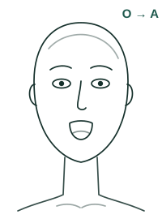

**Passo a passo**

1. Faça um biquinho em “O”, com os lábios bem para frente.
2. Abra a boca dizendo “A”, bem exagerado.
3. Volte ao “O” e repita.

**Confira no espelho:** A boca se mexe bastante e a testa fica parada.

**Adaptação:** com dor, estalo ou disfunção na mandíbula (ATM): Abra pouco a boca no “A”.

> **Para o NotebookLM (Visão geral em vídeo → Personalizar):**
> Crie um vídeo curto, de 2 a 4 minutos, só sobre a aula “L1 “O” e “A”” do FaceZen. Mostre o exercício como um tutorial: para que serve, os 3 passos com calma, a dose de cada nível e como conferir no espelho.
> Use o desenho da aula como imagem principal: explique onde ficam os dedos (em rosa) e o movimento das setas verdes.
> Use comparações do dia a dia, como no texto. A pessoa vai imitar o que ouvir.
> Siga o tom do FaceZen: frases curtas, linguagem neutra em gênero, nenhuma promessa de resultado, e termine lembrando quando parar.

# Módulo 5 · Mandíbula, pescoço e relaxar

Queixo, pescoço e o final da sessão.

### Mandíbula, queixo e papada

*Contorno do queixo, papada e a tensão de quem aperta os dentes.*

## Aula 19 · M1 Lábio para cima

*Queixo e frente do pescoço.*

- **Região:** Mandíbula, queixo e papada
- **Dose:** Iniciante 1 × 10 · Intermediário 2 × 15 · Avançado 3 × 15

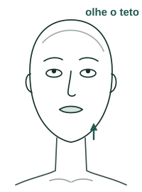

**Passo a passo**

1. Olhe para o teto e empurre o queixo um pouco para frente.
2. Suba o lábio de baixo por cima do de cima.
3. Desça e suba o lábio, devagar.

**Confira no espelho:** Você sente a frente do pescoço trabalhando.

**Adaptação:** com dor ou histórico no pescoço (cervical): Faça olhando para frente, com a cabeça reta.

> **Para o NotebookLM (Visão geral em vídeo → Personalizar):**
> Crie um vídeo curto, de 2 a 4 minutos, só sobre a aula “M1 Lábio para cima” do FaceZen. Mostre o exercício como um tutorial: para que serve, os 3 passos com calma, a dose de cada nível e como conferir no espelho.
> Use o desenho da aula como imagem principal: explique onde ficam os dedos (em rosa) e o movimento das setas verdes.
> Use comparações do dia a dia, como no texto. A pessoa vai imitar o que ouvir.
> Siga o tom do FaceZen: frases curtas, linguagem neutra em gênero, nenhuma promessa de resultado, e termine lembrando quando parar.

## Aula 20 · M4 Soltar o masseter

*Aliviar quem aperta os dentes.*

- **Região:** Mandíbula, queixo e papada
- **Dose:** Iniciante 30 segundos · Intermediário 30 segundos · Avançado 30 segundos

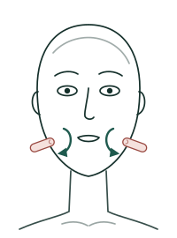

**Passo a passo**

1. Deixe os dentes separados, com a boca levemente aberta.
2. Coloque dois dedos na bochecha, onde a mandíbula faz força ao morder.
3. Faça círculos lentos, com pressão média.

**Confira no espelho:** Nunca em cima da articulação, na frente da orelha.

**Pule se:** Estalo com dor ou travamento.

**Adaptação:** com dor, estalo ou disfunção na mandíbula (ATM): Toque bem leve; pare ao primeiro estalo.

> **Para o NotebookLM (Visão geral em vídeo → Personalizar):**
> Crie um vídeo curto, de 2 a 4 minutos, só sobre a aula “M4 Soltar o masseter” do FaceZen. Mostre o exercício como um tutorial: para que serve, os 3 passos com calma, a dose de cada nível e como conferir no espelho.
> Use o desenho da aula como imagem principal: explique onde ficam os dedos (em rosa) e o movimento das setas verdes.
> Use comparações do dia a dia, como no texto. A pessoa vai imitar o que ouvir.
> Siga o tom do FaceZen: frases curtas, linguagem neutra em gênero, nenhuma promessa de resultado, e termine lembrando quando parar.

### Pescoço e colo

*Postura e tônus do pescoço. No pescoço, a massagem vai sempre de cima para baixo.*

## Aula 21 · P2 Pescoço para baixo

*Relaxar o pescoço.*

- **Região:** Pescoço e colo
- **Dose:** Iniciante 30 segundos · Intermediário 30 segundos · Avançado 30 segundos

**Passo a passo**

1. Espalhe um pouco de creme no pescoço.
2. Deslize as mãos do alto do pescoço até a clavícula.
3. Sempre de cima para baixo, devagar.

**Confira no espelho:** Sem apertar a garganta.

> **Para o NotebookLM (Visão geral em vídeo → Personalizar):**
> Crie um vídeo curto, de 2 a 4 minutos, só sobre a aula “P2 Pescoço para baixo” do FaceZen. Mostre o exercício como um tutorial: para que serve, os 3 passos com calma, a dose de cada nível e como conferir no espelho.
> Use o desenho da aula como imagem principal: explique onde ficam os dedos (em rosa) e o movimento das setas verdes.
> Use comparações do dia a dia, como no texto. A pessoa vai imitar o que ouvir.
> Siga o tom do FaceZen: frases curtas, linguagem neutra em gênero, nenhuma promessa de resultado, e termine lembrando quando parar.

### Relaxamento final

*Um minuto para soltar o rosto e terminar a sessão.*

## Aula 22 · R3 Mandíbula solta

*Terminar soltando os dentes apertados.*

- **Região:** Relaxamento final
- **Dose:** Iniciante 3 respirações · Intermediário 3 respirações · Avançado 3 respirações
- **Onde:** dá para fazer em qualquer lugar, sem as mãos no rosto.

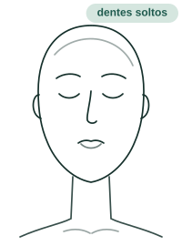

**Passo a passo**

1. Feche os lábios, mas deixe os dentes separados.
2. Deixe a língua descansar no céu da boca.
3. Fique assim por 3 respirações, com a mandíbula pesada.

**Confira no espelho:** Vale fazer também durante o dia, sempre que lembrar.

> **Para o NotebookLM (Visão geral em vídeo → Personalizar):**
> Crie um vídeo curto, de 2 a 4 minutos, só sobre a aula “R3 Mandíbula solta” do FaceZen. Mostre o exercício como um tutorial: para que serve, os 3 passos com calma, a dose de cada nível e como conferir no espelho.
> Use o desenho da aula como imagem principal: explique onde ficam os dedos (em rosa) e o movimento das setas verdes.
> Use comparações do dia a dia, como no texto. A pessoa vai imitar o que ouvir.
> Siga o tom do FaceZen: frases curtas, linguagem neutra em gênero, nenhuma promessa de resultado, e termine lembrando quando parar.

# Módulo 6 · Escova facial (opcional)

Para quem tem a escova de cerdas macias.

## Aula 23 · Escova facial: o que é e como usar

*Um acessório opcional para fazer a massagem com mais conforto.*

**Passo a passo**

1. É uma escova curva, de cerdas macias, que ficou famosa como “escova de drenagem”.
2. No FaceZen ela é opcional: um jeito gostoso de massagear, que ajuda a relaxar. Muita gente sente o rosto menos inchado logo depois, mas é passageiro.
3. Use na pele limpa, com um pouco de hidratante ou óleo para deslizar.
4. A ordem é sempre a mesma: primeiro o pescoço, depois o rosto e por fim a testa.
5. No rosto, sempre do centro para as orelhas. No pescoço, sempre de cima para baixo.
6. Pressão leve: as cerdas deslizam, não esfregam. Nunca perto dos olhos.
7. Depois de usar, lave com água e sabonete neutro e deixe secar com as cerdas para baixo.

**Mais detalhes**

- Escolha cerdas bem macias, sem cheiro forte e com cabo firme.
- É de uso pessoal: não compartilhe.
- Marcou que tem a escova? Ela entra nas suas sessões 2 a 3 vezes por semana, a partir da semana 3.

**Evite**

- Espinha inflamada, rosácea, feridas ou pele irritada
- Logo depois de procedimento estético
- Pele sensível: o app não inclui a escova nas sessões; se quiser testar, comece numa área pequena
- Fazer força ou esfregar

> **Para o NotebookLM (Visão geral em vídeo → Personalizar):**
> Crie um vídeo curto, de 2 a 4 minutos, só sobre a aula “Escova facial: o que é e como usar” do FaceZen. Explique um ponto por vez, na ordem do passo a passo, com um exemplo prático do dia a dia.
> Siga o tom do FaceZen: frases curtas, linguagem neutra em gênero, nenhuma promessa de resultado, e termine lembrando quando parar.

*Para quem tem a escova de cerdas macias: pescoço primeiro, depois rosto e testa, sempre de leve.*

## Aula 24 · E1 Escova no pescoço

*Começar a massagem com a escova pelo pescoço.*

- **Região:** Escova facial (opcional)
- **Dose:** Iniciante 5 passadas de cada lado · Intermediário 5 passadas de cada lado · Avançado 5 passadas de cada lado
- **Lados:** faça de um lado e depois do outro.
- **Material:** escova facial de cerdas macias (opcional).

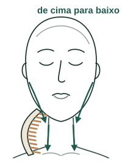

**Passo a passo**

1. Encoste as cerdas de leve atrás da orelha.
2. Desça pela lateral do pescoço até a clavícula, devagar.
3. Faça 5 passadas de cada lado, sempre de cima para baixo.

**Confira no espelho:** As cerdas só deslizam: a pele não fica vermelha nem repuxa.

**Pule se:** Espinha inflamada, ferida, rosácea ou pele irritada.

**Fica fora do plano de quem tem:** pele em crise (acne inflamada, rosácea, eczema, feridas).

> **Para o NotebookLM (Visão geral em vídeo → Personalizar):**
> Crie um vídeo curto, de 2 a 4 minutos, só sobre a aula “E1 Escova no pescoço” do FaceZen. Mostre o exercício como um tutorial: para que serve, os 3 passos com calma, a dose de cada nível e como conferir no espelho.
> Use o desenho da aula como imagem principal: explique onde ficam os dedos (em rosa) e o movimento das setas verdes.
> Use comparações do dia a dia, como no texto. A pessoa vai imitar o que ouvir.
> Siga o tom do FaceZen: frases curtas, linguagem neutra em gênero, nenhuma promessa de resultado, e termine lembrando quando parar.

## Aula 25 · E2 Escova no rosto

*Massagem do centro do rosto para as orelhas.*

- **Região:** Escova facial (opcional)
- **Dose:** Iniciante 5 passadas por linha · Intermediário 5 passadas por linha · Avançado 5 passadas por linha
- **Lados:** faça de um lado e depois do outro.
- **Material:** escova facial de cerdas macias (opcional).

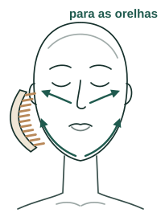

**Passo a passo**

1. Comece no queixo e deslize pela linha da mandíbula até a orelha.
2. Depois, do lado do nariz até a orelha, passando pela bochecha.
3. Termine descendo da orelha até o pescoço.

**Confira no espelho:** Sempre para fora, sem esfregar e longe dos olhos.

**Pule se:** Espinha inflamada, ferida, rosácea ou pele irritada.

**Fica fora do plano de quem tem:** pele em crise (acne inflamada, rosácea, eczema, feridas).

> **Para o NotebookLM (Visão geral em vídeo → Personalizar):**
> Crie um vídeo curto, de 2 a 4 minutos, só sobre a aula “E2 Escova no rosto” do FaceZen. Mostre o exercício como um tutorial: para que serve, os 3 passos com calma, a dose de cada nível e como conferir no espelho.
> Use o desenho da aula como imagem principal: explique onde ficam os dedos (em rosa) e o movimento das setas verdes.
> Use comparações do dia a dia, como no texto. A pessoa vai imitar o que ouvir.
> Siga o tom do FaceZen: frases curtas, linguagem neutra em gênero, nenhuma promessa de resultado, e termine lembrando quando parar.

## Aula 26 · E3 Escova na testa

*Relaxar a testa com a escova.*

- **Região:** Escova facial (opcional)
- **Dose:** Iniciante 5 passadas de cada lado · Intermediário 5 passadas de cada lado · Avançado 5 passadas de cada lado
- **Lados:** faça de um lado e depois do outro.
- **Material:** escova facial de cerdas macias (opcional).

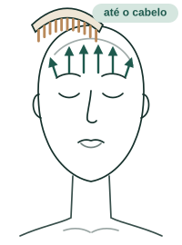

**Passo a passo**

1. Encoste a escova no meio da testa.
2. Deslize até a têmpora, como quem penteia a testa para o lado.
3. Termine descendo da têmpora até a orelha.

**Confira no espelho:** Leve e lento. Não passe sobre as sobrancelhas nem perto dos olhos.

**Pule se:** Espinha inflamada, ferida, rosácea ou pele irritada.

**Fica fora do plano de quem tem:** pele em crise (acne inflamada, rosácea, eczema, feridas).

> **Para o NotebookLM (Visão geral em vídeo → Personalizar):**
> Crie um vídeo curto, de 2 a 4 minutos, só sobre a aula “E3 Escova na testa” do FaceZen. Mostre o exercício como um tutorial: para que serve, os 3 passos com calma, a dose de cada nível e como conferir no espelho.
> Use o desenho da aula como imagem principal: explique onde ficam os dedos (em rosa) e o movimento das setas verdes.
> Use comparações do dia a dia, como no texto. A pessoa vai imitar o que ouvir.
> Siga o tom do FaceZen: frases curtas, linguagem neutra em gênero, nenhuma promessa de resultado, e termine lembrando quando parar.

# Módulo 7 · Skincare: o básico

Limpar, hidratar e proteger bem feito.

## Aula 27 · Limpar do jeito certo

*Limpeza suave de manhã e completa à noite.*

**Passo a passo**

1. Manhã: limpeza suave (gel, espuma ou creme). Pele seca ou sensível pode usar só água morna.
2. Noite, se usou maquiagem ou protetor: primeiro remova (água micelar, óleo ou balm), depois lave.
3. Molhe o rosto com água morna, nunca quente.
4. Use uma moeda pequena de limpador e massageie em círculos por cerca de 1 minuto.
5. Enxágue bem, inclusive a linha do cabelo e o queixo.
6. Seque pressionando a toalha, sem esfregar. Toalha só do rosto, trocada a cada 2 ou 3 dias.

> **Para o NotebookLM (Visão geral em vídeo → Personalizar):**
> Crie um vídeo curto, de 2 a 4 minutos, só sobre a aula “Limpar do jeito certo” do FaceZen. Explique um ponto por vez, na ordem do passo a passo, com um exemplo prático do dia a dia.
> Siga o tom do FaceZen: frases curtas, linguagem neutra em gênero, nenhuma promessa de resultado, e termine lembrando quando parar.

## Aula 28 · Hidratar (inclusive pele oleosa)

*Hidratar fortalece a barreira que protege a pele.*

**Passo a passo**

1. Pele desidratada tende a produzir mais óleo para compensar.
2. O hidratante fortalece a barreira da pele, que protege contra irritação.
3. Quantidade: uma ervilha para cada lado do rosto e uma para a testa.
4. Escolha a textura pela sua pele: gel para oleosa, gel-creme para mista, creme para seca.

> **Para o NotebookLM (Visão geral em vídeo → Personalizar):**
> Crie um vídeo curto, de 2 a 4 minutos, só sobre a aula “Hidratar (inclusive pele oleosa)” do FaceZen. Explique um ponto por vez, na ordem do passo a passo, com um exemplo prático do dia a dia.
> Siga o tom do FaceZen: frases curtas, linguagem neutra em gênero, nenhuma promessa de resultado, e termine lembrando quando parar.

## Aula 29 · Protetor solar: o passo mais importante

*FPS 30 ou mais, na quantidade certa, todos os dias.*

**Passo a passo**

1. Escolha FPS 30 ou mais, com proteção UVA indicada no rótulo.
2. Quantidade: uma colher de chá para rosto e pescoço, o equivalente a 3 dedos de protetor.
3. Achou muito? Aplique duas camadas generosas.
4. Reaplique a cada 2 a 3 horas de exposição e depois de suar ou entrar na água.
5. Todos os dias, mesmo nublado e em casa perto da janela.
6. Tem manchas ou fica no computador? Prefira protetor com cor ou mineral.

**Mais detalhes**

- Um tubo de 50 ml usado na quantidade certa todo dia dura cerca de um mês. Se dura três, você está passando pouco.

> **Para o NotebookLM (Visão geral em vídeo → Personalizar):**
> Crie um vídeo curto, de 2 a 4 minutos, só sobre a aula “Protetor solar: o passo mais importante” do FaceZen. Explique um ponto por vez, na ordem do passo a passo, com um exemplo prático do dia a dia.
> Siga o tom do FaceZen: frases curtas, linguagem neutra em gênero, nenhuma promessa de resultado, e termine lembrando quando parar.

## Aula 30 · A ordem certa dos produtos

*Do mais líquido para o mais denso; protetor por último de manhã.*

**Passo a passo**

1. Manhã: limpeza → tônico (opcional) → vitamina C → sérum → creme de olhos → hidratante → protetor → maquiagem.
2. Noite: demaquilante → limpeza → tônico (opcional) → esfoliante ou máscara (1 a 3 vezes por semana) → yoga facial → sérum de tratamento → creme de olhos → hidratante → óleo.
3. A yoga facial entra depois da limpeza, usando o sérum ou hidratante para deslizar.
4. Retinol e ácidos entram depois dos exercícios, nunca antes: massagear sobre ácido irrita.

> **Para o NotebookLM (Visão geral em vídeo → Personalizar):**
> Crie um vídeo curto, de 2 a 4 minutos, só sobre a aula “A ordem certa dos produtos” do FaceZen. Explique um ponto por vez, na ordem do passo a passo, com um exemplo prático do dia a dia.
> Siga o tom do FaceZen: frases curtas, linguagem neutra em gênero, nenhuma promessa de resultado, e termine lembrando quando parar.

## Aula 31 · Quanto usar de cada produto

*A cola para deixar no espelho.*

**Passo a passo**

1. Limpador ou esfoliante: uma moeda pequena.
2. Sérum: 3 a 4 gotas.
3. Hidratante: uma ervilha por lado e uma na testa.
4. Creme de olhos: um grão de arroz por olho.
5. Pescoço e colo: uma moeda pequena.
6. Protetor: 3 dedos (uma colher de chá) para rosto e pescoço.

> **Para o NotebookLM (Visão geral em vídeo → Personalizar):**
> Crie um vídeo curto, de 2 a 4 minutos, só sobre a aula “Quanto usar de cada produto” do FaceZen. Explique um ponto por vez, na ordem do passo a passo, com um exemplo prático do dia a dia.
> Siga o tom do FaceZen: frases curtas, linguagem neutra em gênero, nenhuma promessa de resultado, e termine lembrando quando parar.

# Módulo 8 · Skincare: os ativos

O que é cada ativo e quando usar.

## Aula 32 · Ácido hialurônico e niacinamida

*Dois ativos gentis, que quase todo mundo tolera.*

**Passo a passo**

1. Ácido hialurônico hidrata e “segura” água. Não esfolia, apesar do nome.
2. Aplique na pele levemente úmida e feche com o hidratante. Manhã e noite.
3. Niacinamida (vitamina B3) ajuda na oleosidade, nos poros, nas manchas e na vermelhidão.
4. É muito bem tolerada: manhã e noite, começando com concentração moderada.

> **Para o NotebookLM (Visão geral em vídeo → Personalizar):**
> Crie um vídeo curto, de 2 a 4 minutos, só sobre a aula “Ácido hialurônico e niacinamida” do FaceZen. Explique um ponto por vez, na ordem do passo a passo, com um exemplo prático do dia a dia.
> Siga o tom do FaceZen: frases curtas, linguagem neutra em gênero, nenhuma promessa de resultado, e termine lembrando quando parar.

## Aula 33 · Vitamina C

*Antioxidante da manhã, parceira do protetor.*

**Passo a passo**

1. Dá viço, uniformiza o tom e ajuda a prevenir manchas.
2. Use de manhã, antes do hidratante e do protetor.
3. A forma pura é mais potente e pode arder; os derivados são mais suaves.
4. Guarde longe da luz. O ácido ferúlico costuma vir junto e potencializa o efeito.

> **Para o NotebookLM (Visão geral em vídeo → Personalizar):**
> Crie um vídeo curto, de 2 a 4 minutos, só sobre a aula “Vitamina C” do FaceZen. Explique um ponto por vez, na ordem do passo a passo, com um exemplo prático do dia a dia.
> Siga o tom do FaceZen: frases curtas, linguagem neutra em gênero, nenhuma promessa de resultado, e termine lembrando quando parar.

## Aula 34 · Ácidos esfoliantes

*Salicílico, glicólico, lático e mandélico: para que serve cada um.*

**Passo a passo**

1. Salicílico (BHA) entra no poro: cravos, espinhas e oleosidade. Pode ressecar.
2. Glicólico (AHA) esfolia: textura, poros e manchas. Pode pinicar no começo.
3. Lático (AHA) é mais suave e hidratante: bom para começar.
4. Mandélico (AHA) é suave e muito tolerado, bom para pele sensível ou negra.
5. De preferência à noite, e protetor obrigatório no dia seguinte.

**Evite**

- Evite ácidos em dias de praia ou piscina.
- Não use dois esfoliantes ao mesmo tempo.

> **Para o NotebookLM (Visão geral em vídeo → Personalizar):**
> Crie um vídeo curto, de 2 a 4 minutos, só sobre a aula “Ácidos esfoliantes” do FaceZen. Explique um ponto por vez, na ordem do passo a passo, com um exemplo prático do dia a dia.
> Siga o tom do FaceZen: frases curtas, linguagem neutra em gênero, nenhuma promessa de resultado, e termine lembrando quando parar.

## Aula 35 · Retinol

*O ativo mais estudado para linhas e textura. Só à noite.*

**Passo a passo**

1. Ajuda em linhas, textura, firmeza e tom.
2. Só à noite, depois dos exercícios.
3. Comece 2 a 3 noites por semana, depois dias alternados, e só então todo dia, se a pele tolerar.
4. Não use na mesma noite que ácido: alterne as noites.

**Evite**

- Proibido na gravidez.
- Suspenda semanas antes de praia.
- Ácido retinoico (tretinoína) é remédio: só com receita.

> **Para o NotebookLM (Visão geral em vídeo → Personalizar):**
> Crie um vídeo curto, de 2 a 4 minutos, só sobre a aula “Retinol” do FaceZen. Explique um ponto por vez, na ordem do passo a passo, com um exemplo prático do dia a dia.
> Siga o tom do FaceZen: frases curtas, linguagem neutra em gênero, nenhuma promessa de resultado, e termine lembrando quando parar.

## Aula 36 · Clareadores

*Para manchas e melasma, sempre com protetor com cor.*

**Passo a passo**

1. Exemplos: alfa-arbutin, ácido tranexâmico e tiamidol.
2. Use conforme o rótulo, com constância.
3. Sem protetor com cor e reaplicação, eles não funcionam.

> **Para o NotebookLM (Visão geral em vídeo → Personalizar):**
> Crie um vídeo curto, de 2 a 4 minutos, só sobre a aula “Clareadores” do FaceZen. Explique um ponto por vez, na ordem do passo a passo, com um exemplo prático do dia a dia.
> Siga o tom do FaceZen: frases curtas, linguagem neutra em gênero, nenhuma promessa de resultado, e termine lembrando quando parar.

## Aula 37 · Fotossensível ou fotossensibilizante?

*Duas palavras parecidas, dois cuidados diferentes.*

**Passo a passo**

1. Fotossensível: o produto se estraga com a luz (ex.: vitamina C pura). Guarde fechado e longe da luz.
2. Fotossensibilizante: o ativo deixa a pele sensível ao sol (ex.: retinol, ácidos). Use à noite e nunca saia sem protetor.

> **Para o NotebookLM (Visão geral em vídeo → Personalizar):**
> Crie um vídeo curto, de 2 a 4 minutos, só sobre a aula “Fotossensível ou fotossensibilizante?” do FaceZen. Explique um ponto por vez, na ordem do passo a passo, com um exemplo prático do dia a dia.
> Siga o tom do FaceZen: frases curtas, linguagem neutra em gênero, nenhuma promessa de resultado, e termine lembrando quando parar.

## Aula 38 · Pode misturar ativos?

*As quatro regras para combinar sem irritar.*

**Passo a passo**

1. Leia o modo de uso do fabricante.
2. Não use dois ativos fortes na mesma noite (ex.: retinol e ácido glicólico). Alterne.
3. Evite repetir a mesma função, como dois esfoliantes.
4. Um produto novo por vez, e espere 2 semanas antes do próximo.

> **Para o NotebookLM (Visão geral em vídeo → Personalizar):**
> Crie um vídeo curto, de 2 a 4 minutos, só sobre a aula “Pode misturar ativos?” do FaceZen. Explique um ponto por vez, na ordem do passo a passo, com um exemplo prático do dia a dia.
> Siga o tom do FaceZen: frases curtas, linguagem neutra em gênero, nenhuma promessa de resultado, e termine lembrando quando parar.

# Módulo 9 · Skincare: a sua rotina

Rotinas por tipo de pele, manchas e hábitos.

## Aula 39 · Texturas: qual escolher

*A textura certa para a sua pele e o seu clima.*

**Passo a passo**

1. Sérum: leve e concentrado. Serve para todos: é o veículo, não a função.
2. Gel: aquoso e sem óleo. Pele oleosa e clima quente.
3. Gel-creme: meio-termo leve. Pele mista, normal ou oleosa desidratada.
4. Loção: parecida com creme, mais leve. Pele normal.
5. Creme: encorpado e nutritivo. Pele seca, madura ou clima frio.
6. No verão, texturas leves. No inverno, ou quando a pele repuxar, mais cremosas.

> **Para o NotebookLM (Visão geral em vídeo → Personalizar):**
> Crie um vídeo curto, de 2 a 4 minutos, só sobre a aula “Texturas: qual escolher” do FaceZen. Explique um ponto por vez, na ordem do passo a passo, com um exemplo prático do dia a dia.
> Siga o tom do FaceZen: frases curtas, linguagem neutra em gênero, nenhuma promessa de resultado, e termine lembrando quando parar.

## Aula 40 · Rotina fixa e reserva

*O que é todo dia e o que entra só quando a pele pede.*

**Passo a passo**

1. Fixa: cuida do que é constante na sua pele (oleosidade, sinais do tempo, melasma). Todo dia.
2. Reserva: entra só quando precisa (secativo para espinha, esfoliante quando a pele está áspera).
3. Liste o que mais te incomoda e escolha um ativo para cada queixa.
4. Comece pelo que mais incomoda. Um produto novo a cada 2 semanas.

> **Para o NotebookLM (Visão geral em vídeo → Personalizar):**
> Crie um vídeo curto, de 2 a 4 minutos, só sobre a aula “Rotina fixa e reserva” do FaceZen. Explique um ponto por vez, na ordem do passo a passo, com um exemplo prático do dia a dia.
> Siga o tom do FaceZen: frases curtas, linguagem neutra em gênero, nenhuma promessa de resultado, e termine lembrando quando parar.

## Aula 41 · Rotina para pele seca

*Conforto e água morna.*

**Passo a passo**

1. Nível 1 · Manhã: água morna, creme hidratante, protetor. Noite: limpador cremoso e creme.
2. Nível 2 · Acrescente ácido hialurônico antes do creme.
3. Nível 3 · Vitamina C derivada de manhã e retinol 2 noites por semana. Óleo facial por último.

**Evite**

- Água quente
- Sabonete em barra comum
- Tônico com álcool
- Esfoliante com grãos

> **Para o NotebookLM (Visão geral em vídeo → Personalizar):**
> Crie um vídeo curto, de 2 a 4 minutos, só sobre a aula “Rotina para pele seca” do FaceZen. Explique um ponto por vez, na ordem do passo a passo, com um exemplo prático do dia a dia.
> Siga o tom do FaceZen: frases curtas, linguagem neutra em gênero, nenhuma promessa de resultado, e termine lembrando quando parar.

## Aula 42 · Rotina para pele oleosa

*Leveza, sem pular o hidratante.*

**Passo a passo**

1. Nível 1 · Gel de limpeza, hidratante em gel e protetor oil-free ou toque seco.
2. Nível 2 · Acrescente niacinamida. À noite, alterne niacinamida e ácido salicílico.
3. Nível 3 · Vitamina C de manhã; à noite, ácido glicólico 2 vezes e retinol 2 vezes por semana, em noites diferentes.

**Evite**

- Ficar sem hidratante
- Lavar mais de 3 vezes ao dia
- Adstringente forte todo dia

> **Para o NotebookLM (Visão geral em vídeo → Personalizar):**
> Crie um vídeo curto, de 2 a 4 minutos, só sobre a aula “Rotina para pele oleosa” do FaceZen. Explique um ponto por vez, na ordem do passo a passo, com um exemplo prático do dia a dia.
> Siga o tom do FaceZen: frases curtas, linguagem neutra em gênero, nenhuma promessa de resultado, e termine lembrando quando parar.

## Aula 43 · Rotina para pele mista

*Equilibrar a zona T sem ressecar as bochechas.*

**Passo a passo**

1. Nível 1 · Gel de limpeza suave, gel-creme e protetor.
2. Nível 2 · Acrescente niacinamida manhã e noite.
3. Nível 3 · Vitamina C de manhã; à noite, salicílico só na zona T 2 vezes e retinol 2 vezes por semana.
4. Se as bochechas repuxarem, creme mais nutritivo só nelas.

> **Para o NotebookLM (Visão geral em vídeo → Personalizar):**
> Crie um vídeo curto, de 2 a 4 minutos, só sobre a aula “Rotina para pele mista” do FaceZen. Explique um ponto por vez, na ordem do passo a passo, com um exemplo prático do dia a dia.
> Siga o tom do FaceZen: frases curtas, linguagem neutra em gênero, nenhuma promessa de resultado, e termine lembrando quando parar.

## Aula 44 · Rotina para pele normal

*Manter o que já está bom.*

**Passo a passo**

1. Nível 1 · Limpador suave, loção ou gel-creme e protetor.
2. Nível 2 · Vitamina C de manhã; à noite, ácido hialurônico ou niacinamida.
3. Nível 3 · Vitamina C com ferúlico; retinol 3 noites por semana, avançando aos poucos.

> **Para o NotebookLM (Visão geral em vídeo → Personalizar):**
> Crie um vídeo curto, de 2 a 4 minutos, só sobre a aula “Rotina para pele normal” do FaceZen. Explique um ponto por vez, na ordem do passo a passo, com um exemplo prático do dia a dia.
> Siga o tom do FaceZen: frases curtas, linguagem neutra em gênero, nenhuma promessa de resultado, e termine lembrando quando parar.

## Aula 45 · Rotina para pele sensível

*Menos produtos, sem fragrância, sempre testando antes.*

**Passo a passo**

1. Nível 1 · Limpador sem fragrância (ou só água), hidratante simples e protetor mineral.
2. Nível 2 · Niacinamida em concentração baixa de manhã; ácido hialurônico à noite.
3. Nível 3 · Só com orientação de dermatologista.
4. Sempre teste um produto novo atrás da orelha ou na parte de dentro do braço por 7 a 10 dias.

> **Para o NotebookLM (Visão geral em vídeo → Personalizar):**
> Crie um vídeo curto, de 2 a 4 minutos, só sobre a aula “Rotina para pele sensível” do FaceZen. Explique um ponto por vez, na ordem do passo a passo, com um exemplo prático do dia a dia.
> Siga o tom do FaceZen: frases curtas, linguagem neutra em gênero, nenhuma promessa de resultado, e termine lembrando quando parar.

## Aula 46 · Complementos por objetivo

*O que acrescentar ao básico, conforme o que te incomoda.*

**Passo a passo**

1. Linhas e firmeza: retinol à noite (não na gravidez), ácido hialurônico, peptídeos.
2. Manchas: vitamina C, um clareador e protetor com cor, reaplicado.
3. Acne e cravos: ácido salicílico, niacinamida e secativo só na espinha.
4. Olhos inchados: creme de olhos com cafeína e rolo ou colher gelados de manhã.
5. Pescoço: leve todos os produtos até o colo, inclusive o protetor.

> **Para o NotebookLM (Visão geral em vídeo → Personalizar):**
> Crie um vídeo curto, de 2 a 4 minutos, só sobre a aula “Complementos por objetivo” do FaceZen. Explique um ponto por vez, na ordem do passo a passo, com um exemplo prático do dia a dia.
> Siga o tom do FaceZen: frases curtas, linguagem neutra em gênero, nenhuma promessa de resultado, e termine lembrando quando parar.

## Aula 47 · Manchas: o combo que funciona

*Protetor, luz visível, clareador e zero atrito.*

**Passo a passo**

1. Protetor na quantidade certa e reaplicado.
2. Proteção contra a luz visível: protetor com cor ou base por cima da mancha.
3. Um clareador, com constância.
4. Zero atrito: não esfregue toalha, algodão ou esponja.
5. Não esprema espinhas: é a principal causa de mancha pós-acne.

**Evite**

- Mancha que muda de cor, sangra, coça ou cresce: dermatologista.

> **Para o NotebookLM (Visão geral em vídeo → Personalizar):**
> Crie um vídeo curto, de 2 a 4 minutos, só sobre a aula “Manchas: o combo que funciona” do FaceZen. Explique um ponto por vez, na ordem do passo a passo, com um exemplo prático do dia a dia.
> Siga o tom do FaceZen: frases curtas, linguagem neutra em gênero, nenhuma promessa de resultado, e termine lembrando quando parar.

## Aula 48 · Hábitos que mudam a pele

*Pequenas escolhas diárias que somam.*

**Passo a passo**

1. Nunca durma de maquiagem. Deixe água micelar perto da cama para os dias de preguiça.
2. Água morna, nunca quente.
3. Lave o rosto no máximo 3 vezes ao dia.
4. Lave pincéis e esponjas toda semana.
5. Não fique passando a mão no rosto nem esprema espinhas.
6. Durma bem e beba água. Quando a pele arder, menos ativos e mais hidratação.

> **Para o NotebookLM (Visão geral em vídeo → Personalizar):**
> Crie um vídeo curto, de 2 a 4 minutos, só sobre a aula “Hábitos que mudam a pele” do FaceZen. Explique um ponto por vez, na ordem do passo a passo, com um exemplo prático do dia a dia.
> Siga o tom do FaceZen: frases curtas, linguagem neutra em gênero, nenhuma promessa de resultado, e termine lembrando quando parar.

## Aula 49 · Mimo de fim de semana

*Uma máscara calmante simples, opcional.*

**Passo a passo**

1. Misture 5 colheres de chá de aveia bem fina com 2 de mel.
2. Teste antes na parte de dentro do pulso e espere 24 horas.
3. Aplique no rosto limpo, longe dos olhos, por 10 minutos.
4. Remova com água morna, sem esfregar, e passe o hidratante.

**Evite**

- Não coloque no rosto: limão, bicarbonato, açúcar, pasta de dente ou óleo essencial puro.

> **Para o NotebookLM (Visão geral em vídeo → Personalizar):**
> Crie um vídeo curto, de 2 a 4 minutos, só sobre a aula “Mimo de fim de semana” do FaceZen. Explique um ponto por vez, na ordem do passo a passo, com um exemplo prático do dia a dia.
> Siga o tom do FaceZen: frases curtas, linguagem neutra em gênero, nenhuma promessa de resultado, e termine lembrando quando parar.

# Módulo 10 · Acompanhe a evolução

Fotos, expectativas realistas e dúvidas.

## Aula 50 · Foto de acompanhamento

*Uma vez por semana, sempre do mesmo jeito.*

**Passo a passo**

1. Mesma luz: de frente para uma janela, de dia.
2. Mesma distância: câmera na altura dos olhos.
3. Sem maquiagem, sem filtro, cabelo preso.
4. Quatro fotos: de frente relaxado, de frente sorrindo, perfil direito e perfil esquerdo.
5. Compare a semana 1 com a 4 e a 8, não dia a dia. As fotos ficam só com você.

> **Para o NotebookLM (Visão geral em vídeo → Personalizar):**
> Crie um vídeo curto, de 2 a 4 minutos, só sobre a aula “Foto de acompanhamento” do FaceZen. Explique um ponto por vez, na ordem do passo a passo, com um exemplo prático do dia a dia.
> Siga o tom do FaceZen: frases curtas, linguagem neutra em gênero, nenhuma promessa de resultado, e termine lembrando quando parar.

## Aula 51 · O que é realista esperar

*Sem promessas: o que muitas pessoas relatam.*

**Passo a passo**

1. Logo depois da sessão: rosto corado, menos inchado, sensação de relaxamento. É temporário.
2. Em 1 a 3 semanas: mais consciência de quando você franze ou aperta os dentes.
3. Em 4 a 8 semanas: algumas pessoas percebem diferença nas fotos. Varia muito.
4. Depende de constância, idade, genética, sono, sol e skincare. Não há garantia.

> **Para o NotebookLM (Visão geral em vídeo → Personalizar):**
> Crie um vídeo curto, de 2 a 4 minutos, só sobre a aula “O que é realista esperar” do FaceZen. Explique um ponto por vez, na ordem do passo a passo, com um exemplo prático do dia a dia.
> Siga o tom do FaceZen: frases curtas, linguagem neutra em gênero, nenhuma promessa de resultado, e termine lembrando quando parar.

## Aula 52 · Os erros mais comuns

*O que atrapalha, para você não repetir.*

**Passo a passo**

1. Fazer com a pele seca, que repuxa e marca.
2. Trabalhar só a área que incomoda e esquecer o resto do rosto.
3. Exagerar na força, nas repetições ou no tempo.
4. Franzir a testa nos exercícios de olhos e boca.
5. Pular o aquecimento ou o dia de descanso.
6. Usar ferramenta com força: marca roxa não é sinal de que funcionou.
7. Pular o protetor, usar pouco ou achar que pele oleosa não precisa de hidratante.
8. Começar vários produtos novos na mesma semana.
9. Desistir em uma semana, ou comparar fotos com luz diferente.

> **Para o NotebookLM (Visão geral em vídeo → Personalizar):**
> Crie um vídeo curto, de 2 a 4 minutos, só sobre a aula “Os erros mais comuns” do FaceZen. Explique um ponto por vez, na ordem do passo a passo, com um exemplo prático do dia a dia.
> Siga o tom do FaceZen: frases curtas, linguagem neutra em gênero, nenhuma promessa de resultado, e termine lembrando quando parar.

## Aula 53 · Perguntas frequentes

*As dúvidas que mais aparecem, em uma frase cada.*

**Passo a passo**

1. Funciona? Trabalha músculo, circulação, postura e relaxamento. Não substitui procedimentos e não tem resultado garantido.
2. Pode causar ruga? Pode marcar se feito com exagero, com a pele seca ou franzindo. Por isso há doses e espelho.
3. Todo dia? Sim, com um dia de descanso por semana.
4. Grávida? Converse com o obstetra. Nada de retinol e nada de pescoço para trás.
5. Tenho acne. Faça os exercícios sem toque e não passe as mãos sobre as espinhas inflamadas.
6. Preciso de gua sha? Não. As mãos bastam.
7. Qual o melhor protetor? O que você gosta de usar todo dia, na quantidade certa.

> **Para o NotebookLM (Visão geral em vídeo → Personalizar):**
> Crie um vídeo curto, de 2 a 4 minutos, só sobre a aula “Perguntas frequentes” do FaceZen. Explique um ponto por vez, na ordem do passo a passo, com um exemplo prático do dia a dia.
> Siga o tom do FaceZen: frases curtas, linguagem neutra em gênero, nenhuma promessa de resultado, e termine lembrando quando parar.

---

*Total: 53 aulas. Conteúdo próprio do FaceZen, gerado a partir do app. Não substitui avaliação médica, dermatológica ou fisioterapêutica.*
